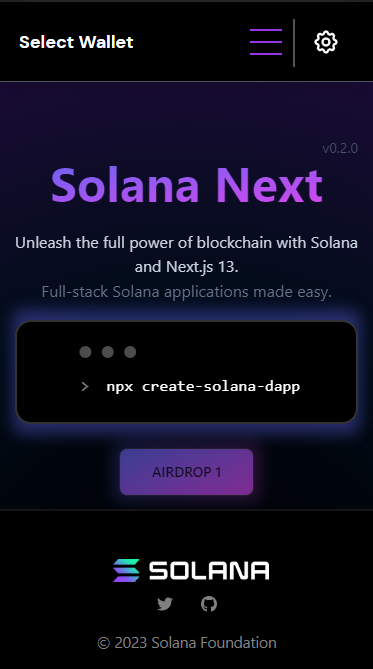
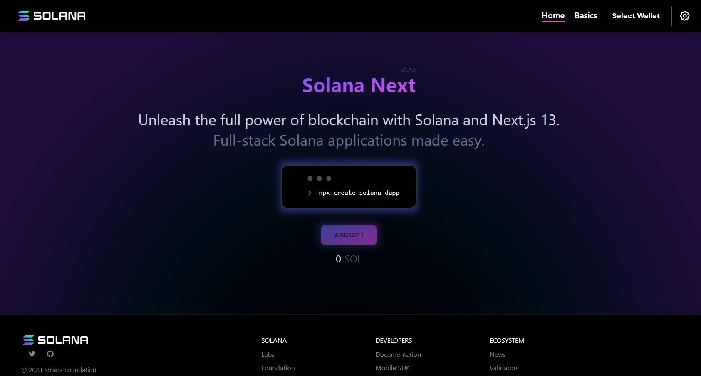

# Solana dApp Scaffold Próximo

Os repositórios Solana dApp Scaffold destinam-se a abrigar bons andaimes iniciais para que os desenvolvedores do ecossistema comecem a trabalhar rapidamente com uma IU de cliente front-end que integra vários recursos comuns encontrados em dApps com alguns exemplos básicos de uso. Integração de carteira. Gestão do estado. Exemplos de componentes. Notificações. Recomendações de configuração.

Responsivo | Área de Trabalho
:-------------------------:|:---------------------- ----:
 | 

## Começando

Este é um projeto [Next.js](https://nextjs.org/) inicializado com [`create-next-app`](https://github.com/vercel/next.js/tree/canary/packages /criar-próximo-aplicativo).

A versão responsiva para carteiras e adaptador de carteira pode não funcionar ou funcionar como esperado para dispositivos móveis com base na compatibilidade de plugins e carteiras. Para mais exemplos de código e implementações, visite o [Solana Cookbook](https://solanacookbook.com/)

## Instalação

```bash
npm install
# ou
yarn install
```

## Construir e Executar

Em seguida, execute o servidor de desenvolvimento:

```bash
npm run dev
# ou
yarn run dev
```

Abra [http://localhost:3000](http://localhost:3000) com seu navegador para ver o resultado.

Você pode começar a editar a página modificando `pages/index.tsx`. A página é atualizada automaticamente conforme você edita o arquivo.

[Rotas de API](https://nextjs.org/docs/api-routes/introduction) podem ser acessadas em [http://localhost:3000/api/hello](http://localhost:3000/api/hello ). Este endpoint pode ser editado em `pages/api/hello.ts`.

O diretório `pages/api` é mapeado para `/api/*`. Os arquivos neste diretório são tratados como [rotas de API](https://nextjs.org/docs/api-routes/introduction) em vez de páginas React.

## Características

Cada Scaffold conterá pelo menos os seguintes recursos:

```
Integração de carteira com Auto Connect / Refresh

Gerenciamento de estado

Componentes: Um ou mais componentes que demonstram gerenciamento de estado

Web3 Js: Exemplos de um ou mais usos de web3 js, incluindo uma transação com um provedor de conexão

Exemplo de navegação e mudança de página para demonstrar o estado

Estilo Simples Limpo

Notificações (opcional): Exemplo de uso de um sistema de notificação

```

Um repositório de componentes Solana será lançado em um futuro próximo para abrigar uma biblioteca de componentes comuns.


### Estrutura

A estrutura do projeto de andaime pode variar de acordo com a estrutura de front-end que está sendo utilizada. Abaixo está um exemplo de estrutura para o Next js Scaffold.
 
```
├── public : arquivos hospedados publicamente
├── src: pastas e arquivos de código primário
│ ├── componentes : devem abrigar qualquer coisa considerada um componente de interface do usuário reutilizável
│ ├── contexts` : qualquer contexto considerado reutilizável e útil para muitos componentes que podem ser passados através de uma árvore de componentes
│ ├── hooks` : quaisquer funções que permitem 'enganchar' em estado de reação ou recursos de ciclo de vida de componentes de função
│ ├── models` : qualquer estrutura de dados que pode ser reutilizada ao longo do projeto
│ ├── pages` : as páginas que hospedam metadados e a `Visualização` pretendida para a página
│ ├── stores`: lojas usadas no gerenciamento de estado
│ ├── estilos` : contém qualquer estilo global e reutilizável
│ ├── utils` : qualquer outra funcionalidade considerada código reutilizável que pode ser referenciado
│ ├── views` : contém as visualizações reais do projeto que incluem o conteúdo principal e os componentes dentro
estilo, pacote, configuração e outros arquivos de projeto

```

## Contribuindo

Qualquer pessoa pode criar um problema para criar, discutir ou solicitar um novo recurso ou atualizar a base de código existente. Lembre-se do seguinte ao enviar um problema. Consideramos a fusão de recursos de alto valor que podem ser utilizados pela maioria dos usuários de scaffold. Se esse não for um recurso ou correção comum, considere adicioná-lo à biblioteca de componentes ou livro de receitas. Consulte a arquitetura e o estilo do projeto ao contribuir.

Se enviar um recurso, consulte a estrutura do projeto mostrada acima e tente seguir a arquitetura geral e o estilo apresentados no andaime existente.

### Compromisso

Para escolher uma tarefa ou fazer a sua própria, faça o seguinte:

1. [Adicione um problema](https://github.com/solana-dev-adv/solana-dapp-next/issues/new) para a tarefa e atribua-o a você mesmo ou comente sobre o problema
2. Faça um rascunho de PR referenciando o problema.

O fluxo geral para fazer uma contribuição:

1. Faça um fork do repositório no GitHub
2. Clone o projeto em sua própria máquina
3. Confirme as alterações em sua própria ramificação
4. Empurre seu trabalho de volta para o garfo
5. Envie uma solicitação pull para que possamos revisar suas alterações

**NOTA**: Certifique-se de mesclar o mais recente de "upstream" antes de fazer uma
puxa pedido!

Você pode encontrar tarefas no [quadro do projeto](https://github.com/solana-dev-adv/solana-dapp-next/projects/1)
ou crie um problema e atribua-o a si mesmo.


## Saiba Mais Próxima Js

Para saber mais sobre o Next.js, consulte os seguintes recursos:

- [Documentação do Next.js](https://nextjs.org/docs) - conheça os recursos e a API do Next.js.
- [Learn Next.js](https://nextjs.org/learn) - um tutorial interativo do Next.js.

## Implantar no Vercel

A maneira mais fácil de implantar seu aplicativo Next.js é usar a [Plataforma Vercel](https://vercel.com/new?utm_medium=default-template&filter=next.js&utm_source=create-next-app&utm_campaign=create-next-app -readme) dos criadores de Next.js.

Confira nossa [documentação de implantação do Next.js](https://nextjs.org/docs/deployment) para obter mais detalhes.